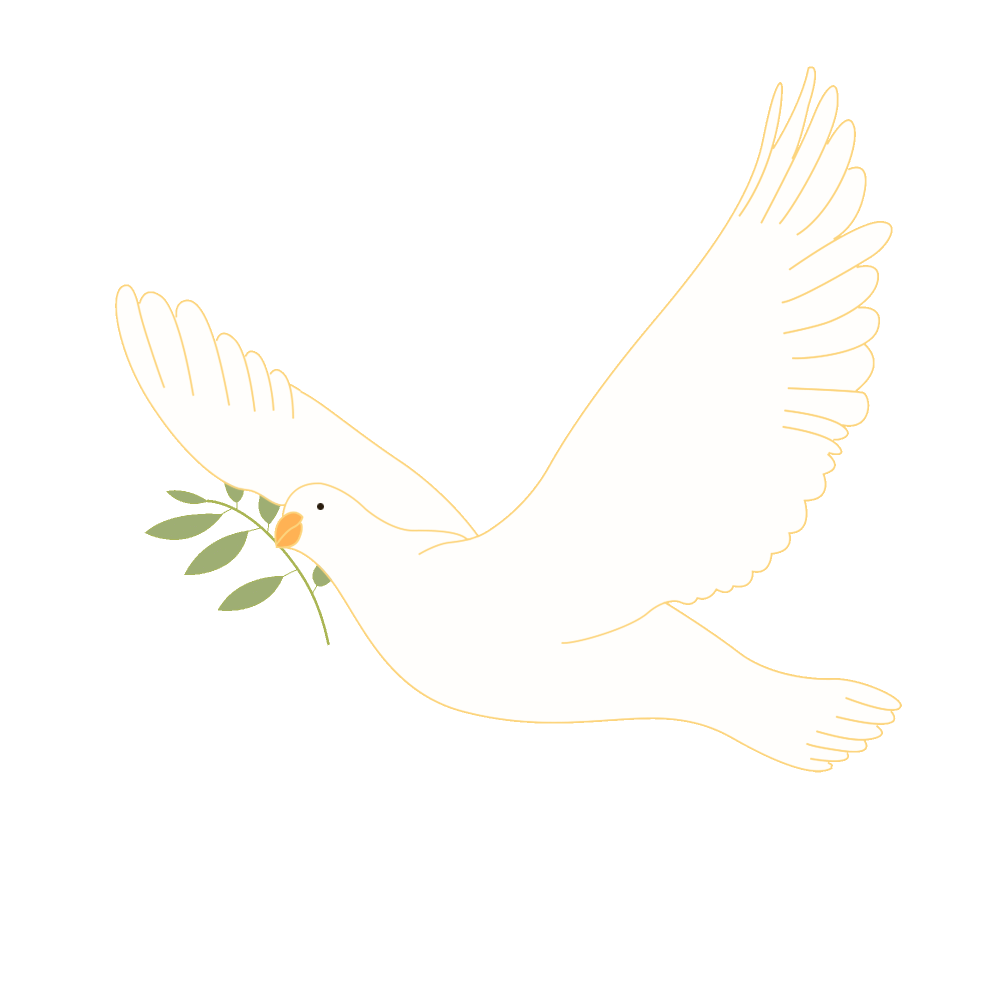

# yluo0801_9103_Creative-coding-major-project

This is a timer-based project, where the dove of peace will keep flapping its wings.

I chose to use time to drive my code.

The dove's wings will flap back and forth.

This gif is the inspiration for my code modification.

Control the frequency and amplitude of angle1 and angle2 through sin(frameCount * 0.05) (I have tried functions such as cos and tan, but I personally feel that the visual effect of sin is more natural), and adjust the wing position by adding or subtracting values ​​appropriately. Adding angles to the coordinates of the Bezier curve causes the curve and shape to change on the canvas. The angle value fluctuates through trigonometric functions to produce a smooth, periodic animation effect.

In the same way, I add the color change of the pigeon. I use sin()*128+128 to set a color value that changes randomly between 0 and 256 (i.e. 255), and then assign it to stroke() to achieve the color change.
